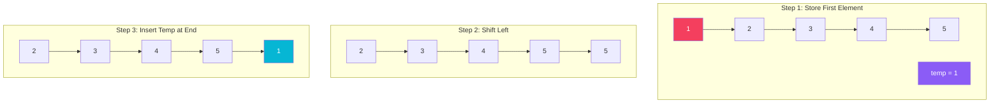
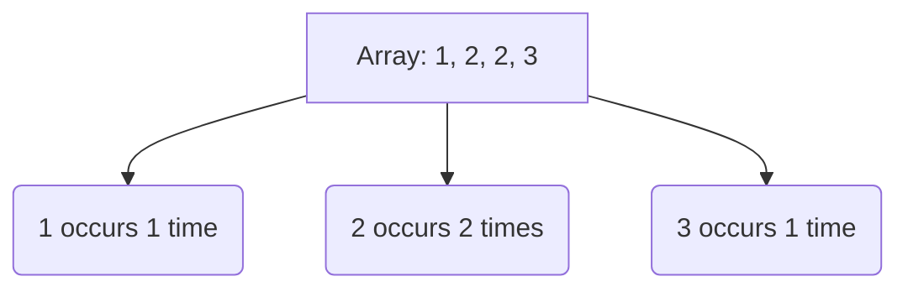

# Arrays

An **Array** is a linear data structure that collects elements of the same data type and stores them in contiguous and adjacent memory locations. Arrays work on an index system starting from 0.

## Types of Arrays
1. **One-Dimensional Arrays**: Elements are stored in a single continuous row.
2. **Multi-Dimensional Arrays**: Data is stored in tabular form, like a 2D matrix.

## Key Operations

### 1. Array Rotation
Rotating an array involves shifting its elements to the left or right by a certain number of positions.



```java
// Example: Left Rotation by 1
int temp = arr[0];
for (int j = 0; j < arr.length - 1; ++j) {
    arr[j] = arr[j + 1];
}
arr[arr.length - 1] = temp;
```

### 2. Finding Duplicates
Checking if an array contains duplicate values. This can be visualized as comparing every element with all subsequent elements.

```mermaid
graph LR
    subgraph Outer Loop i=0
        direction LR
        Pivot[1] -.-> cmp1[3]
        Pivot -.-> cmp2[1]
        style cmp2 fill:#f43f5e,color:#fff
        style Pivot fill:#8b5cf6,color:#fff
    end
```

```java
for(int i = 0; i < size; i++) {
    for(int j = i + 1; j < arr.length; j++) {
        if(arr[i] == arr[j]) {
            System.out.println("duplicate: " + arr[j]);
        }
    }
}
```

### 3. Frequency of Elements
Counting how many times each element appears in the array. This is often solved by keeping a frequency array or using a HashMap.



## Array Characteristics
| Characteristic | Description |
| :--- | :--- |
| **Fixed Size** | Once initialized, the size of a standard array cannot be changed. |
| **Fast Lookup** | Accessing an element by index takes $O(1)$ time. |
| **Slow Insertion** | Inserting or deleting an element in the middle takes $O(N)$ time as elements must be shifted. |
