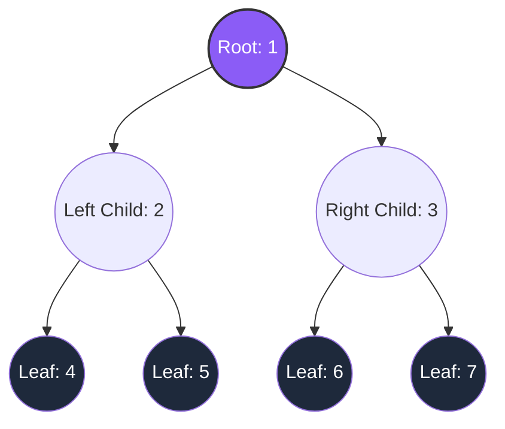
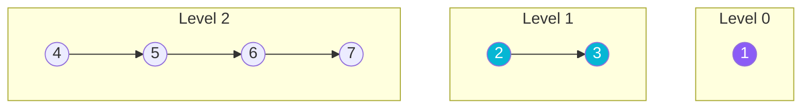
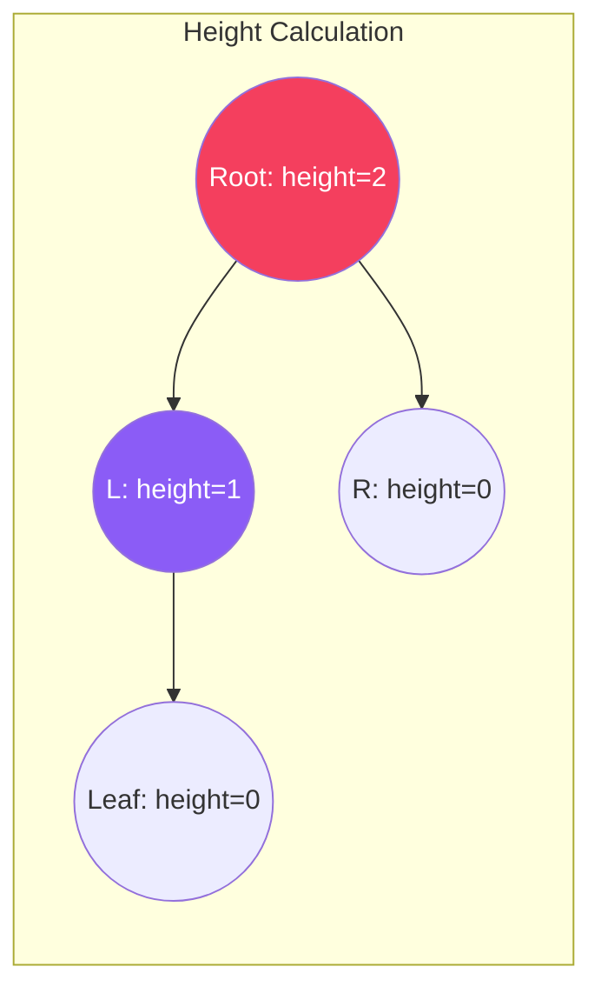
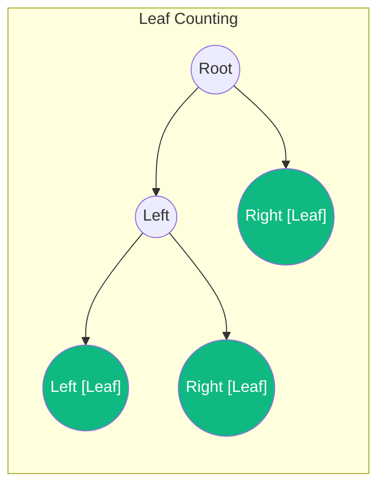

# Binary Tree Data Structure

A **Binary Tree** is a non-linear hierarchical data structure in which each node has at most two children, referred to as the **left child** and the **right child**.

## Tree Anatomy and Structure



## Tree Traversals

Unlike linear data structures, trees can be traversed in several ways:

| Traversal | Logic / Order | Complexity (Time/Space) |
| :--- | :--- | :---: |
| **Preorder** | Node $\rightarrow$ Left $\rightarrow$ Right | $O(N)$ / $O(H)$ |
| **Inorder** | Left $\rightarrow$ Node $\rightarrow$ Right | $O(N)$ / $O(H)$ |
| **Postorder** | Left $\rightarrow$ Right $\rightarrow$ Node | $O(N)$ / $O(H)$ |
| **Level-Order (BFS)** | Level by level, Left to Right | $O(N)$ / $O(N)$ |

*Note: $N$ is the number of nodes, $H$ is the height of the tree.*

---

## Step-by-Step Traversal Diagrams

Given the tree structure above:

### 1. Inorder Traversal (Left, Node, Right)
Visits elements in bottom-up left-to-right projection order: `4 → 2 → 5 → 1 → 6 → 3 → 7`.


### 2. Level-Order Traversal (BFS)
Traverses level by level from top to bottom.



---

## Tree Metrics & Operations

Beyond traversal, several recursive operations are fundamental to understanding the tree's state.

### 1. Height of a Tree (`height()`)
The height is the number of edges on the longest path from the root to a leaf. It is calculated recursively: $1 + \max(\text{height}(\text{left}), \text{height}(\text{right}))$.



### 2. Count Nodes & Leaves
- **`countNodes()`**: Returns the total number of nodes in the tree ($1 + \text{leftCount} + \text{rightCount}$).
- **`countLeaves()`**: Returns the number of nodes that have both left and right children as `null`.



---

## Java Implementation Examples

```java
public class BinaryTree {
    static class Node {
        int data;
        Node left, right;
        Node(int data) { this.data = data; }
    }

    private Node root;

    // Inorder Traversal Helper
    public void inorder() {
        inorderHelper(root);
    }

    private void inorderHelper(Node node) {
        if (node == null) return;
        inorderHelper(node.left);
        System.out.print(node.data + " ");
        inorderHelper(node.right);
    }
}
```
