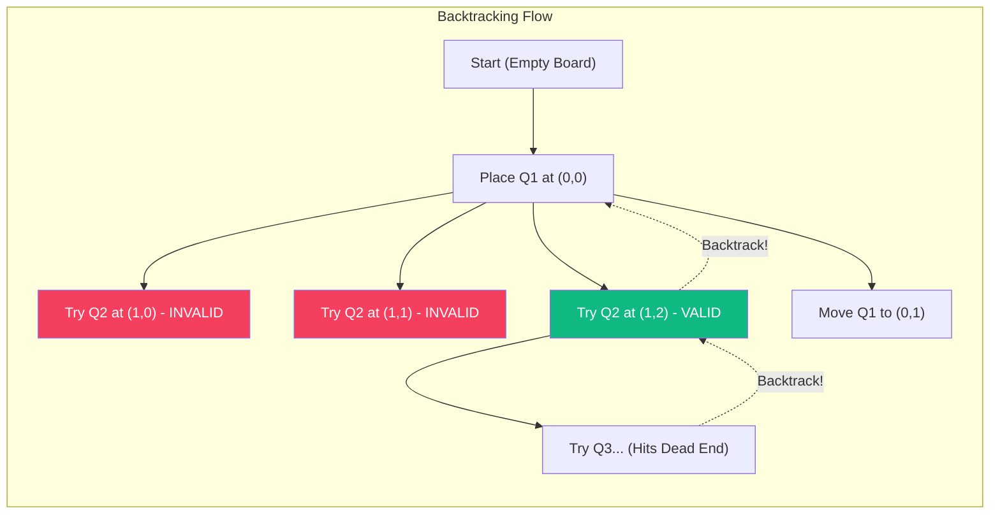
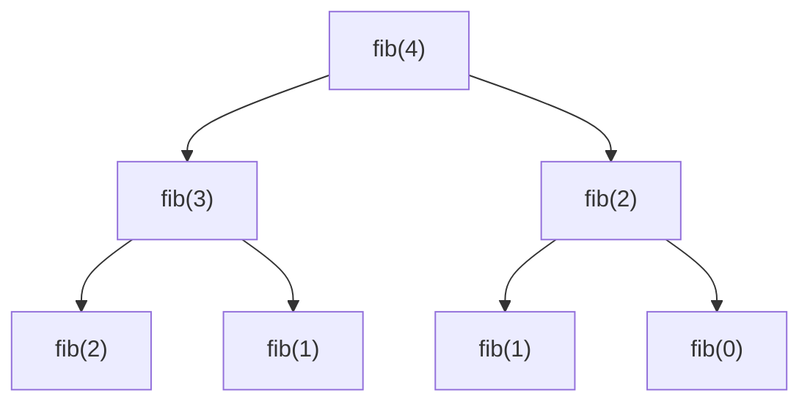

# Recursion

**Recursion** is a method where the solution to a problem depends on solutions to smaller instances of the same problem. A recursive function calls itself directly or indirectly.

## Core Concepts

Every recursive function must have two main components:
1. **Base Case**: The condition under which the function stops calling itself to prevent infinite loops.
2. **Recursive Step**: The part where the function calls itself with modified parameters, moving closer to the base case.

## Classic Recursive Problems

### 1. Factorial
Calculating $N! = N \times (N-1)!$
```java
public int factorial(int n) {
    if (n == 0 || n == 1) return 1; // Base case
    return n * factorial(n - 1);    // Recursive step
}
```

### 2. Tower of Hanoi
A mathematical puzzle where the objective is to move a stack of disks from one rod to another, following specific rules.
```java
public void hanoi(int n, char source, char auxiliary, char target) {
    if (n == 1) {
        System.out.println("Move disk 1 from " + source + " to " + target);
        return;
    }
    hanoi(n - 1, source, target, auxiliary);
    System.out.println("Move disk " + n + " from " + source + " to " + target);
    hanoi(n - 1, auxiliary, source, target);
}
```

### 3. N-Queens Problem (Backtracking)
Placing $N$ chess queens on an $N \times N$ chessboard so that no two queens threaten each other. Recursion is used to explore paths and backtrack when a path fails.



## Recursion Tree Example (Fibonacci)


## Complexity
Recursion can be elegant but often comes with a higher Space Complexity $O(N)$ due to the implicit use of the Call Stack. Techniques like **Memoization** and **Tail Recursion** are used to optimize recursive calls.
